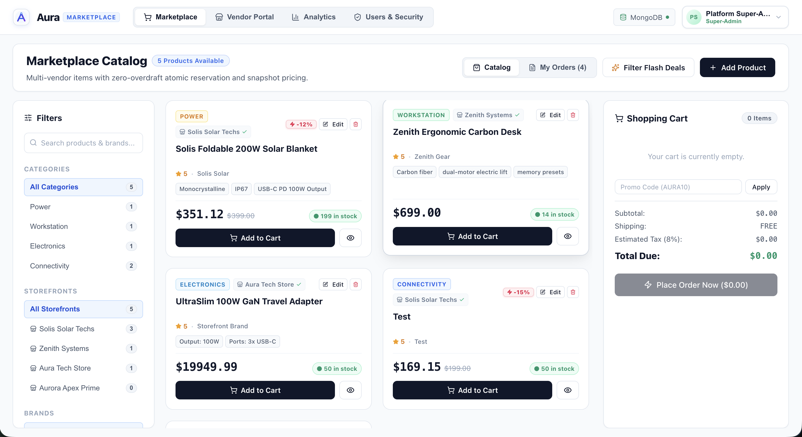
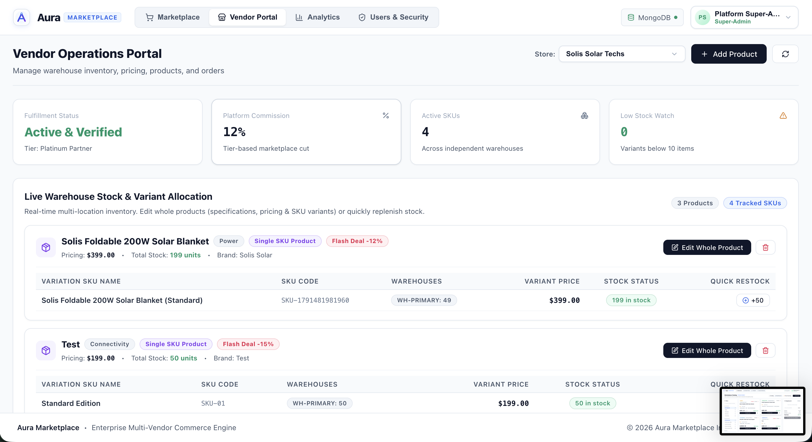
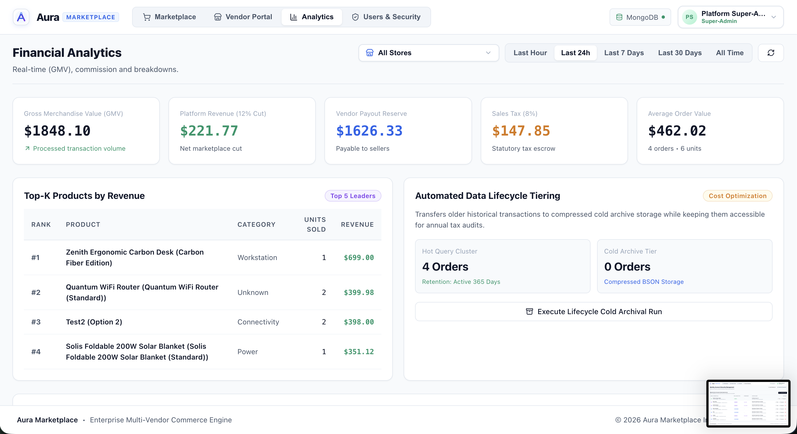
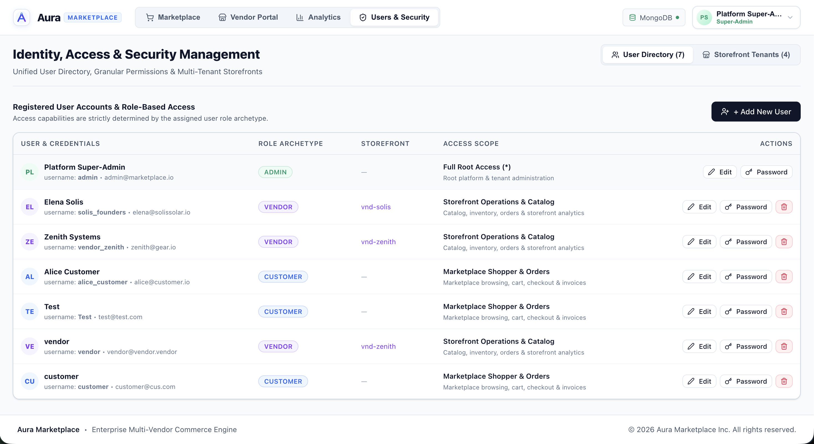

# TejX Enterprise Multi-Vendor E-Commerce & Financial Platform

A full-stack, enterprise-grade **Multi-Vendor Marketplace, Real-Time Financial Analytics & Operations Engine** built with:
1. **`mongo-sdk/`**: Standalone, pure TejX MongoDB wire-protocol package (OP_MSG, full BSON encoder/decoder, SCRAM authentication).
2. **`backend/`**: High-performance REST API service compiled natively with the TejX compiler into native machine code with zero-overdraft atomic stock reservation and dual-mode persistence.
3. **`frontend/`**: Ultra-modern React + TypeScript operations dashboard featuring the public Marketplace, Vendor Operations Portal, Financial Analytics Matrix, and Enterprise IAM & Security Center.

---

## 📸 Platform Overview & Visual Tour

### 1. Aura Marketplace Catalog
Public multi-vendor marketplace featuring faceted category & storefront filters, flash deal discounts, real-time cart calculation, tax estimation, and atomic checkout.



### 2. Multi-Tenant Vendor Operations Portal
Dedicated portal for independent vendors to manage storefront listings, multi-location warehouse SKU inventories, stock replenishment, and fulfillment orders.



### 3. Real-Time Financial Analytics Matrix
Executive analytics suite tracking Gross Merchandise Value (GMV), 12% platform revenue cut, 8% statutory tax escrow, net vendor payouts, Top-K revenue products, and automated cold data lifecycle tiering.



### 4. Enterprise Identity, Access & Security Management (IAM)
Administrator-only security center managing user lifecycles, role archetypes (`admin`, `vendor`, `customer`, `guest`), credentials, storefront tenant associations, and audit controls.



---

## 🏗️ Architecture & Directory Layout

```text
tejx-demo/
├── images/                        # Platform UI screenshots & architecture diagrams
│   ├── Marketplace.png            # Aura Marketplace catalog & cart view
│   ├── VendorPortal.png           # Vendor inventory & SKU warehouse operations
│   ├── Analytics.png              # Real-time financial analytics matrix
│   └── UserManagement.png         # Enterprise IAM & Security Center
│
├── mongo-sdk/                     # Standalone pure TejX MongoDB Driver Package
│   ├── src/
│   │   ├── index.tx               # Public driver exports (MongoClient, MongoDatabase)
│   │   ├── client.tx              # OP_MSG wire protocol client
│   │   ├── bson.tx                # Full BSON serializer and deserializer
│   │   ├── auth.tx                # SCRAM-SHA-256 and SCRAM-SHA-1 authentication
│   │   ├── config.tx              # Mongo URI & configuration parser
│   │   └── json.tx                # Typed BSON-to-JSON bridge
│   ├── tests/
│   │   ├── test_bson.tx           # BSON encoder/decoder verification
│   │   └── test_client.tx         # Client handshake test
│   └── README.md
│
├── backend/                       # Native TejX REST Backend Engine
│   ├── src/
│   │   ├── main.tx                # Server entry point & startup probe
│   │   ├── server/                # HTTP server, routing engine, CORS preflight
│   │   └── app/                   # Core state, domain models, feature handlers
│   │       ├── core/              # Dual persistence probe, MongoDB bridge, security
│   │       ├── router/            # Route dispatch & parameter extraction
│   │       └── features/
│   │           ├── auth/          # Cryptographic JWT, RBAC, session blacklist, IAM
│   │           ├── marketplace/   # Catalog, cart, checkout, inventory, orders
│   │           ├── analytics/     # Financial ledger, GMV, Top-K, data tiering
│   │           └── database/      # Database telemetry & connection diagnostics
│   ├── build.sh                   # Native Mach-O compilation script
│   └── README.md
│
├── frontend/                      # React Frontend Application (Vite + React + TS)
│   ├── src/
│   │   ├── components/            # Marketplace, VendorPortal, Analytics, Security
│   │   ├── services/api.ts        # Typed HTTP client & JWT session management
│   │   ├── styles/index.css       # Clean, modern design system
│   │   ├── App.tsx                # Main application coordinator & view router
│   │   └── main.tsx
│   ├── vite.config.js             # Dev server & reverse proxy configuration
│   └── README.md
│
├── start.sh                       # Unified single-command launcher
├── package.json                   # Root workspace management
└── README.md
```

---

## 🏛️ Key Platform Modules

### 1. Aura Marketplace (`/marketplace`)
- **Public Catalog Browsing**: Open to everyone (guests and authenticated users).
- **Faceted Search Pipeline**: Real-time aggregation across categories, price brackets, and brands.
- **Atomic Zero-Overdraft Checkout**: Pre-flight validation guarantees variant stock never dips below zero; rejects concurrent overdrafts with `409 Conflict`.
- **API Idempotency Layer**: `X-Idempotency-Key` prevents duplicate charges and double order deductions on accidental retries.
- **Point-in-Time Invoice Snapshots**: Historical order records snapshot pricing, taxes, and vendor cuts at purchase time.
- **Strict User Order Scoping**: Marketplace "My Orders" displays orders belonging strictly to the signed-in user (`customerId == claims.sub || customerEmail == claims.email`), keeping personal purchases completely separate from storefront sales.

### 2. Vendor Operations Portal (`/vendor`)
- **Storefront Isolation**: Independent vendors can only manage products, inventories, and fulfillment records for their assigned storefront (`vendorId`).
- **Multi-Location Warehouse Inventory**: SKU tracking across primary, regional, and reserve warehouses.
- **Quick Restock & Full Product Editor**: In-place SKU restock actions and rich multi-variant configuration updates.

### 3. Financial & Real-Time Analytics Matrix (`/analytics`)
- **Financial Metric Breakdown**: Instant computation of GMV, 12% platform revenue cut, 8% sales tax escrow, and net vendor payouts.
- **Top-K Revenue Leaders**: Ranked product analysis by unit sales and gross revenue.
- **Data Lifecycle Tiering**: Automated archival of historical transactions to cold BSON storage.
- **DevOps Telemetry**: Outbox event stream inspector, token-bucket rate limiter metrics, and stress-testing harness.

### 4. Identity, Access & Security Management (IAM) (`/security`)
- **Strict RBAC Enforcement**:
  - `admin`: Full platform control, user directory CRUD, financial ledger, and database tools.
  - `vendor`: Storefront catalog management, SKU restocking, and fulfillment orders.
  - `customer`: Public browsing, cart checkout, and personal order history.
  - `guest`: Read-only catalog browsing.
- **Cryptographic JWT Sessions**: Stateless token verification extracting authenticated claims (`sub`, `role`, `vendorId`, `email`).
- **Token Blacklisting**: Immediate logout revocation using an in-memory and persistent blacklist cache.
- **Zero Hardcoded Backdoors**: Strict credential validation without mock fallbacks or demo bypasses.

---

## 🍃 Dual-Engine Persistence Architecture

The platform features an enterprise dual-persistence engine:

1. **MongoDB Live Mode** (`mongodb://127.0.0.1:27017`):
   - Communicates via `mongo-sdk` using pure BSON wire-protocol (OP_MSG).
   - Persists all collections (`users`, `marketplace_products`, `marketplace_orders`, `storefronts`, `outbox_events`).
   - The top navigation displays a green **`MongoDB Live`** indicator.

2. **Resilient In-Memory Fallback Mode** (`memory://local-runtime`):
   - If MongoDB is offline or disconnected, the backend seamlessly falls back to high-speed in-memory state.
   - All mutations, checkouts, and inventory updates continue serving without server crashes or 500 errors.
   - The top navigation displays an amber **`In-Memory`** status indicator.

---

## 🚀 Quick Start

### 1. Launch All Services (Single Command)

```bash
cd tejx-demo
./start.sh
```

This single command will:
1. Load environment variables from `backend/.env` and `frontend/.env`.
2. Compile the native TejX backend binary with `backend/build.sh`.
3. Launch the native TejX backend on `http://127.0.0.1:8080`.
4. Launch the React frontend on `http://localhost:3000`.

### 2. Manual Commands

```bash
# Build the native backend binary
bash backend/build.sh

# Run the backend standalone
./backend/build/server

# Test the Mongo SDK wire protocol driver
npm run test:sdk

# Run the React frontend in development mode
npm run start:frontend
```

---

## ⚙️ Environment Configuration

### Backend (`backend/.env`)

```env
PORT=8080
HOST=127.0.0.1
MONGO_URI=mongodb://127.0.0.1:27017/tejx_marketplace_db
# Initial root administrator provisioned at startup
ADMIN_USERNAME=admin
ADMIN_PASSWORD=admin
JWT_SECRET=super-secret-jwt-key-for-tejx-marketplace-production
```

### Frontend (`frontend/.env`)

```env
VITE_PORT=3000
VITE_BACKEND_URL=http://127.0.0.1:8080
VITE_APP_TITLE=Aura Marketplace | Multi-Vendor E-Commerce & Financial Platform
```

---

## 🔌 Core API Endpoints

| Method | Path | Access Scope | Description |
|---|---|---|---|
| `POST` | `/api/auth/login` | Public | Authenticates credentials and returns signed JWT |
| `GET` | `/api/auth/me` | Authenticated | Retrieves current authenticated profile from JWT |
| `POST` | `/api/auth/logout` | Authenticated | Revokes active token and adds to blacklist |
| `GET` | `/api/auth/users` | Admin Only | Lists all registered user accounts |
| `POST` | `/api/auth/users` | Admin Only | Provisions a new user account with role & tenant |
| `PUT` | `/api/auth/users/:id` | Admin Only | Updates user details, email, or role archetype |
| `DELETE` | `/api/auth/users/:id` | Admin Only | Deletes a user account |
| `GET` | `/api/marketplace/catalog` | Public | Fetches products with faceted filtering |
| `POST` | `/api/marketplace/checkout` | Authenticated | Executes atomic zero-overdraft checkout |
| `GET` | `/api/marketplace/orders` | Authenticated | Retrieves scoped order history (personal or vendor) |
| `GET` | `/api/marketplace/orders/:id` | Authenticated | Fetches immutable point-in-time order snapshot |
| `GET` | `/api/marketplace/vendor/inventory` | Vendor / Admin | Retrieves warehouse SKU allocations |
| `POST` | `/api/marketplace/vendor/inventory/stock` | Vendor / Admin | Replenishes warehouse stock for a SKU |
| `POST` | `/api/marketplace/products` | Vendor / Admin | Creates or updates product specifications |
| `GET` | `/api/analytics/realtime` | Authenticated | Computes GMV, platform fees, taxes, and vendor payout |
| `GET` | `/api/analytics/top-products` | Authenticated | Returns Top-K revenue-generating products |
| `POST` | `/api/analytics/tiering/run` | Admin Only | Triggers automated data lifecycle archival run |
| `GET` | `/api/db/health` | Public | Inspects database connection status and telemetry |
